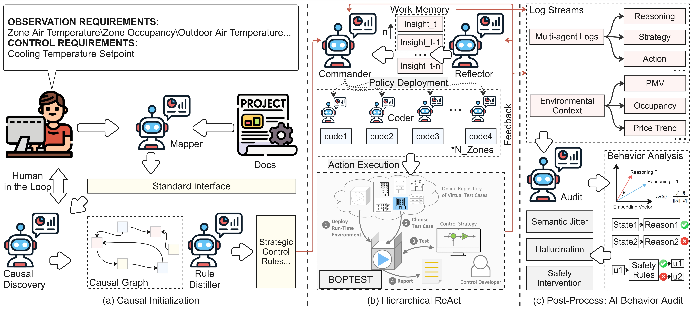

# Causal-augmented Hierarchical Control Framework (CHCF)



## 📄 Abstract

With the continuous growth in electricity demand within the building sector, there is an urgent need for efficient and universal HVAC control strategies. While mainstream approaches such as Deep Reinforcement Learning (DRL) have demonstrated excellent performance, they are often constrained by heavy data dependency, generalization bottlenecks, and scalability issues in multi-zone systems. Large Language Models (LLMs), with their general reasoning capabilities, offer a promising pathway to overcome these limitations. However, applying LLMs to building control remains limited by the risk of reasoning hallucinations, a lack of physical safety guarantees, and inherent context window limitations.

To address these challenges, this study proposes a **Causal-augmented Hierarchical Control Framework (CHCF)**. The framework implements a hierarchical ReAct (Reasoning and Acting) architecture, where a strategic layer performs global coupled reasoning for coordinated cross-zone long-horizon planning, and an execution layer handles local decoupled code translation. By integrating a causal discovery mechanism, the framework injects physical inductive bias into the reasoning loop.

Experimental results based on the **BOPTEST** platform demonstrate that CHCF achieves up to a **42.14% reduction in energy consumption** compared to Rule-Based Control (RBC). In multi-zone tasks, CHCF maintains higher energy efficiency while exhibiting superior control robustness compared to DRL. Specifically, it reduced discomfort duration from 7.50 hours to 0.25 hours in hydronic systems and decreased comfort violations by 22% in all-air systems. Quantitative auditing further reveals a U-shaped relationship between the working memory window and decision stability, providing empirical evidence for optimizing context filtering strategies.

## 🚀 Key Features

* **Hierarchical ReAct Architecture:** Decouples high-level strategic reasoning (Commander Agent) from low-level control execution (Coder Agent).
* **Causal Injection:** Uses a dedicated Discovery Agent to distill physical rules and causal graphs, reducing LLM hallucinations and ensuring physical plausibility.
* **Zero-Shot Generalization:** Capable of controlling heterogeneous building configurations (Air/Hydronic, Single/Multi-zone) without prior training.
* **Self-Reflection & Memory:** Includes a Reflector Agent that analyzes performance and updates a RAG-based memory for continuous improvement.
* **Quantitative Audit:** Includes tools to analyze semantic jitter, hallucination rates, and decision stability.

## 📂 Directory Structure

```text
Causal_augmented_Hierarchical_Control/
├── agents/                     # LLM Agent Implementations
│   ├── agent_a_mapper.py       # Semantic Mapper (System Integration)
│   ├── agent_b_commander.py    # Strategic Commander (High-level planning)
│   ├── agent_b_coder.py        # Zone Coder (Python code generation)
│   ├── agent_c_reflector.py    # Reflector (Performance Analysis)
│   └── prompts.py              # System Prompts
├── configs/                    # Building Maps and Causal Rules
│   ├── bestest_air_mapping.json
│   ├── *_causal_rules.txt
│   └── *_strategic_rules.txt
├── core/                       # Core Infrastructure
│   ├── boptest_client.py       # Interface with BOPTEST Simulation
│   ├── memory_manager.py       # ChromaDB Vector Memory
│   ├── observation_builder.py  # State processing
│   └── reward_calculator.py    # PMV and Energy reward logic
├── phase0_causal_discovery.py  # Script for Causal Graph Generation
├── rule_distiller.py           # Distills Causal Graphs into Strategy Rules
├── main_evolution.py           # Main Experiment Loop
├── log_analyzer.py             # Post-experiment Analysis & Auditing
├── plot_analysis.py            # Visualization Tools
├── check_env.py                # Environment Health Check
├── config.py                   # Global Configuration
├── static_config.py            # Static Parameters (Physics, Schedules)
└── Overview_Framework.jpg      # Framework Diagram
```

## 🛠️ Installation & Setup

### 1. Prerequisites
* Python 3.10+
* [Docker](https://www.docker.com/) (Required for running BOPTEST)
* [BOPTEST](https://github.com/ibpsa/project1-boptest) Service running locally (default port 80).

### 2. Install Dependencies
```bash
pip install openai chromadb pandas numpy matplotlib seaborn python-dotenv requests tiktoken
# Optional: pythermalcomfort for precise PMV calculations
pip install pythermalcomfort
```

### 3. Environment Configuration
Create a `.env` file in the root directory and add your API keys:
```env
DEEPSEEK_API_KEY=your_deepseek_key
DEEPSEEK_BASE_URL=https://api.deepseek.com
OPENAI_API_KEY=your_openai_key  # Used for Embeddings
```

## 🏃 Usage Guide

### Phase 0: Causal Initialization
Before running the control loop, generate the causal rules and semantic mapping for the target building.
```bash
# Generate Causal Graphs
python phase0_causal_discovery.py

# Distill Causal Graphs into Strategic Rules
python rule_distiller.py
```

### Phase 1-3: Evolutionary Control Loop
Run the main hierarchical control loop. This handles Warmup (RBC), Exploration, and Evaluation phases.
```bash
python main_evolution.py
```
*Note: Ensure the BOPTEST test case container is running and accessible.*

### Phase 4: Analysis & Auditing
Analyze the logs to generate metrics on hallucinations, semantic jitter, and performance plots.
```bash
python log_analyzer.py
python plot_analysis.py
```

## 📊 Performance Comparison

| Metric | Rule-Based Control (RBC) | **CHCF (Ours)** | Improvement |
| :--- | :--- | :--- | :--- |
| **Energy Consumption** | Baseline | **-42.14%** | ⭐ Significant |
| **Discomfort Duration (Hydronic)** | 7.50 Hours | **0.25 Hours** | ⭐ Robust |
| **Comfort Violations (All-Air)** | Baseline | **-22%** | ⭐ Precise |