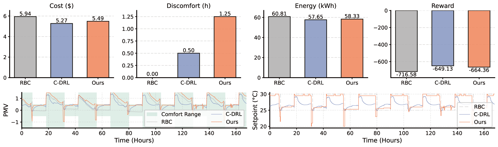
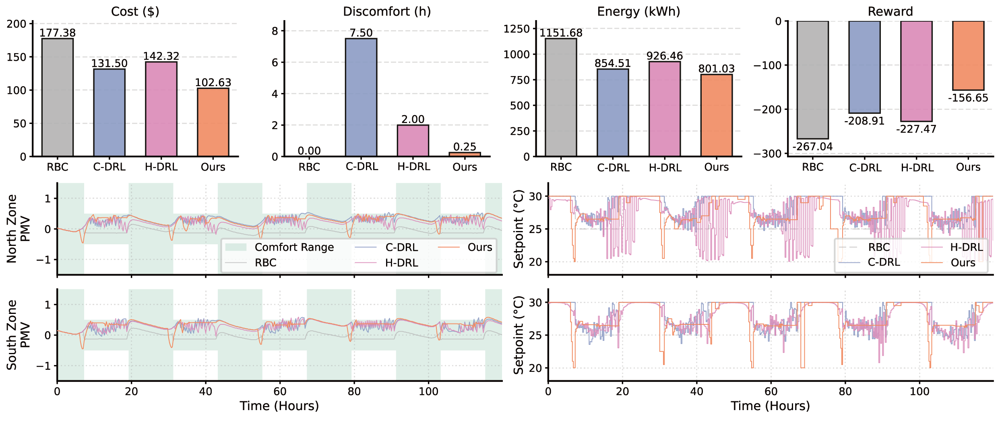
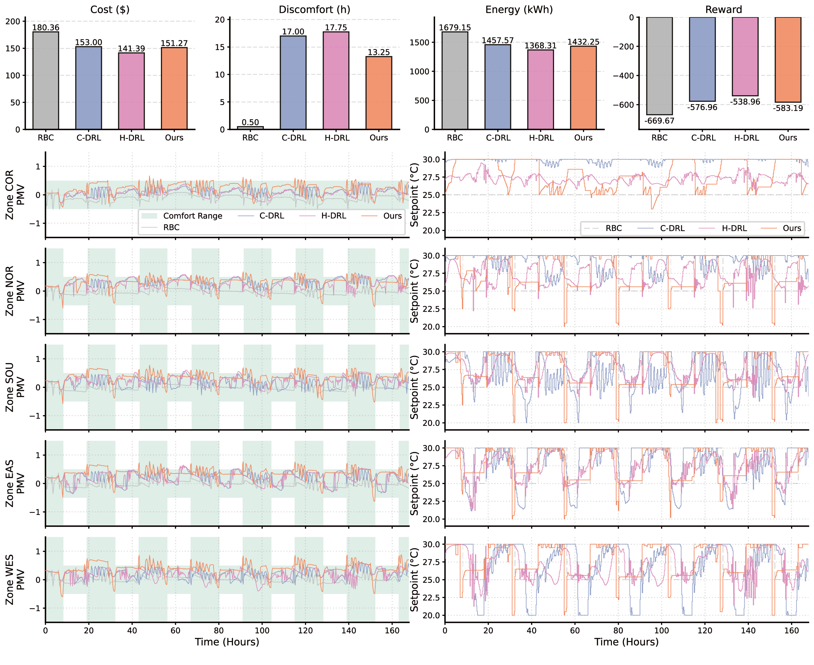
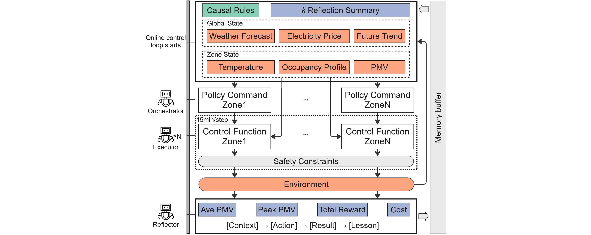

# Causal-augmented Hierarchical LLM Agents for Building Control

<p align="center">
  
</p>

<p align="center">
  <a href="https://www.python.org/downloads/"></a>
  <a href="https://github.com/ibpsa/project1-boptest"></a>
  <a href="LICENSE"></a>
</p>

> **Paper**: *Causal-augmented Hierarchical LLM Agents for Building Control*
>
> **Authors**: Weilin Xin, Wei Liang, Adrian Chong
>
> **Affiliation**: Department of the Built Environment, National University of Singapore

---

## Abstract

Multi-zone building HVAC control requires scalable methods that generalize across heterogeneous configurations without per-building retraining. This study proposes a **causal-augmented hierarchical control framework** for zero-shot generalization. Informed by causal rules derived from building documentation, the framework adopts a language-model-based multi-agent (LM-MA) architecture that decouples control into **strategic planning**, **safety-constrained execution**, and **closed-loop reflection with working memory**.

Experiments on three benchmark cases with distinct HVAC configurations yield **7.67--42.14% cost savings** over rule-based control. Compared with deep reinforcement learning (DRL), the framework performs competitively; in the best-performing dual-zone hydronic case, it achieves **6.26--13.54% energy savings** and reduces discomfort from 2.00--7.50 to **0.25 zone-hours**. Causal augmentation reduces hallucination rates by up to **86.3%** while virtually eliminating safety violations.

---

## Key Results

### Control Performance Comparison

| Case | HVAC System | Cost Savings vs RBC | Discomfort (zone-hrs) | Energy (kWh) |
|:-----|:------------|:-------------------:|:---------------------:|:------------:|
| **SZ_Air** | Single-zone ideal VAV | 7.67% | 1.25 | 58.33 |
| **MZ_Hydro** | Dual-zone FCU hydronic | **42.14%** | **0.25** | **801.03** |
| **MZ_Air** | Five-zone VAV + AHU | 16.13% | 13.25 | 1511.87 |

### Causal Augmentation Ablation

| Metric | SZ_Air | MZ_Hydro | MZ_Air |
|:-------|:------:|:--------:|:------:|
| Hallucination rate reduction | 86.3% | 77.7% | 17.8% |
| Safety intervention reduction | 98.8% | 98.6% | 100% |

### Performance Visualizations

<table>
<tr>
<td align="center"><b>Single-zone All-Air (SZ_Air)</b></td>
<td align="center"><b>Dual-zone Hydronic (MZ_Hydro)</b></td>
</tr>
<tr>
<td></td>
<td></td>
</tr>
</table>

<p align="center">
  <b>Five-zone All-Air (MZ_Air)</b><br/>
  
</p>

---

## Framework Architecture

The framework operates in two phases:

**Phase 0 (Offline):** A Mapper agent standardizes BMS variables, a Causal Discovery agent (human-in-the-loop) constructs a qualitative causal graph, and a Rule Distiller translates it into strategic control rules.

**Online Control Loop (Hourly):**
1. **Orchestrator** -- analyzes global state, forecasts, causal rules, and working memory to generate strategic directives per zone
2. **Executor** (one per zone) -- translates directives into executable Python code with four hard safety constraints
3. **Reflector** -- evaluates hourly performance and generates structured insights stored in a sliding-window memory

<p align="center">
  
</p>

---

## Directory Structure

```
Causal_augmented_Hierarchical_Control/
├── agents/                        # LLM Agent Implementations
│   ├── agent_a_mapper.py          #   Mapper: BMS variable standardization
│   ├── agent_b_commander.py       #   Orchestrator: strategic planning
│   ├── agent_b_coder.py           #   Executor: code generation + safety
│   ├── agent_c_reflector.py       #   Reflector: performance analysis
│   └── prompts.py                 #   System prompts for all agents
├── core/                          # Core Infrastructure
│   ├── boptest_client.py          #   BOPTEST simulation interface
│   ├── observation_builder.py     #   State observation construction
│   ├── reward_calculator.py       #   Multi-objective reward function
│   └── memory_manager.py          #   Vector memory store
├── configs/                       # Building Configs (3 case studies)
│   ├── *_mapping.json             #   Standardized variable schemas
│   ├── *_causal_rules.txt         #   Qualitative causal graphs
│   └── *_strategic_rules.txt      #   Distilled control strategies
├── DRL Baselines/                 # DRL Baseline Implementations
│   ├── SZ_Air/DRL_SZ_Air.ipynb    #   PPO for single-zone case
│   ├── MZ_Hydro/DRL_MZ_Hydro.ipynb#   PPO + MAPPO for hydronic case
│   └── MZ_Air/DRL_MZ_Air.ipynb    #   PPO + MAPPO for all-air case
├── paper/                         # Paper Manuscript & Figures
│   ├── Main_4_28.tex              #   LaTeX manuscript
│   └── figs2/                     #   All figures
├── main_evolution.py              # Main experiment loop
├── phase0_causal_discovery.py     # Causal graph construction
├── rule_distiller.py              # Causal graph → strategic rules
├── static_config.py               # Physical parameters & constraints
├── config.py                      # API & path configuration
├── log_analyzer.py                # Post-experiment audit metrics
├── plot_analysis.py               # Visualization utilities
├── check_env.py                   # Environment health check
└── requirements.txt               # Python dependencies
```

---

## Installation & Usage

### Prerequisites
- Python 3.10+
- [Docker](https://www.docker.com/) (required for running BOPTEST)
- [BOPTEST](https://github.com/ibpsa/project1-boptest) service running locally

### Install Dependencies
```bash
pip install -r requirements.txt
```

### Environment Configuration
Create a `.env` file in the root directory:
```env
DEEPSEEK_API_KEY=your_deepseek_key
DEEPSEEK_BASE_URL=https://api.deepseek.com
OPENAI_API_KEY=your_openai_key  # Used for embeddings
```

### Run

**Phase 0: Causal Initialization**
```bash
python phase0_causal_discovery.py
python rule_distiller.py
```

**Phase 1--3: Hierarchical Control Loop**
```bash
python main_evolution.py
```

**Phase 4: Analysis & Audit**
```bash
python log_analyzer.py
python plot_analysis.py
```

---

## Citation

If you find this work useful, please cite:

```bibtex
@article{xin2025causal,
  title={Causal-augmented Hierarchical LLM Agents for Building Control},
  author={Xin, Weilin and Liang, Wei and Chong, Adrian},
  year={2025}
}
```

## License

This project is licensed under the MIT License -- see [LICENSE](LICENSE) for details.
