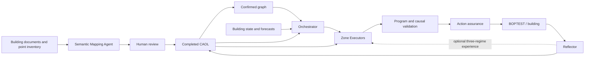

# Hierarchical Causal-Constrained Control (H3C)

H3C is a reproducible, cooling-only framework for hierarchical building control. It combines
LLM-based coordination, zone-level executable programs, human-confirmed causal constraints, and
a deterministic action-assurance chain. The repository also provides human-in-the-loop case
onboarding and independent RBC, DRL, and hierarchical MPC benchmarks for three BOPTEST cases.

All physical commands are dry plans unless `--execute` is explicit.



## Workflows

| Workflow | Purpose | Command |
|---|---|---|
| Online H3C | Coordinated program updates with causal and action assurance | `h3c` |
| Offline onboarding | Mapping, causal discovery, human approval, and graph export | `h3c offline` |
| Independent baselines | Basic RBC, canonical P0/eRBC, frozen PPO/MAPPO policies, and hierarchical MPC | `h3c-baseline` |

Online control uses H3C's deterministic runtime. Microsoft Agent Framework is an optional
dependency used only by offline onboarding. Baseline evaluation does not create Agent, causal,
program, budget, or action-assurance evidence unless the controller actually uses that surface.

## Installation

Python 3.11 or newer is required. `pyproject.toml` and `uv.lock` are the dependency owners.

```console
# Online H3C and development checks
uv sync --extra dev

# Mapping and human-in-the-loop causal discovery
uv sync --extra offline

# Frozen DRL inference, hierarchical MPC, and benchmark figures
uv sync --extra baselines

# Complete contributor environment
uv sync --extra dev --extra offline --extra baselines
```

Pip-compatible dependency exports are also provided:

```console
python -m venv .venv
.venv\Scripts\python -m pip install -r requirements.txt
.venv\Scripts\python -m pip install -r requirements-offline.txt
.venv\Scripts\python -m pip install -r requirements-baselines.txt
.venv\Scripts\python -m pip install --no-deps -e .
```

Run the pip workflow from a cloned repository. The editable install intentionally resolves
`configs/`, `models/`, and `outputs/` from that repository root.

Copy `.env.example` as a local template. Never store credentials in repository files.

## Quick start

```console
# Resolve online runs
h3c run --profile MZ_Air
h3c run --profile MZ_Air --long-term-memory
h3c suite main

# Audit an eligible failed run, then recover it in a fresh run/test after review
h3c resume outputs/runs/<suite>/<case>/<failed_run_id>
h3c resume outputs/runs/<suite>/<case>/<failed_run_id> --execute

# Verify frozen policy assets
h3c-baseline models verify

# Resolve one baseline or the complete formal matrix
h3c-baseline run --case MZ_Hydro --controller h-drl
h3c-baseline suite formal

# Resolve hierarchical MPC identification and its three-arm formal suite
h3c-baseline mpc train --case all --workers 4 --max-fit-episodes 64
h3c-baseline mpc verify-model --case MZ_Hydro
h3c-baseline suite mpc-formal

# Verify and report completed evidence
h3c-baseline verify outputs/baselines/runs/<suite>/<case>/<run_id>
h3c-baseline report outputs/baselines/runs/formal
```

Add `--execute` only after reviewing the resolved plan.

Online H3C uses the previous completed hour's per-zone Context–Action–Outcome–Lesson record as
its sole Agent-visible `k=1` working memory. This is the production default. The retained
`--long-term-memory` interface enables a separate, non-default reproducibility ablation with one
zone-specific experience slot for each of `unoccupied`, `occupancy_transition`, and
`steady_state_occupancy`; it is not used by the current experiment programme. Without that flag,
no long-term-memory, CRUD, revision, or reference field is rendered or accepted. Complete
bilingual one-hour contracts are in
[English](docs/h3c_complete_hour_io_en.md) and [Chinese](docs/h3c_complete_hour_io_zh.md).

The final framework release boundary and its first execution-healthy formal result are recorded in
[the 2026-09-02 release note](docs/final_framework_release_20260902.md). Generated release evidence
remains under `outputs/` and is intentionally not committed to Git.

Offline onboarding has explicit human review pauses and checkpointed recovery:

```console
h3c offline discover --spec configs/onboarding/example_spec.json
h3c offline discover --spec configs/onboarding/example_spec.json --reviewer <name> --execute
h3c offline resume outputs/offline/<case>/<workflow_id> --reviewer <name> --execute
h3c offline verify outputs/offline/<case>/<workflow_id>
```

See the [offline onboarding guide](docs/offline_onboarding.md) and
[operator guide](docs/operator_guide.md) for the full interaction contracts.

## Evaluation protocol

Every arm uses a fresh BOPTEST test identity, a 15-minute control step, dynamic electricity
price, one initialization with a seven-day BOPTEST internal warm-up, no explicit control prefix,
and one stop.

| Case | Evaluation start | Evaluation window | Public occupancy |
|---|---:|---:|---|
| SZ_Air | day 203 | 7 days | raw occupancy |
| MZ_Hydro | day 220 | 5 days | raw occupancy |
| MZ_Air | day 199 | 7 days | `[06:00,19:00) AND raw > 0` |

The frozen MZ_Air DRL policies retain their training-time raw-binary occupancy input while public
control routing and KPI calculation use official occupancy. All controllers share the same
physical initialization, reward, comfort, and KPI owners.

## Formal benchmark

| Case | Basic RBC | P0 / enhanced RBC | C-DRL | H-DRL | Hierarchical MPC |
|---|:---:|:---:|:---:|:---:|:---:|
| SZ_Air | ✓ | ✓ | 1-policy PPO | — | 1-zone hierarchy |
| MZ_Hydro | ✓ | ✓ | 1-policy PPO | 2-actor MAPPO | 2-zone hierarchy |
| MZ_Air | ✓ | ✓ | 1-policy PPO | 5-actor MAPPO | 5-zone hierarchy |

The RBC/DRL formal suite contains 11 fresh, strictly serial arms. P0/eRBC executes the same canonical
cooling program and action-assurance owner used by H3C. DRL checkpoints are loaded on CPU in
deterministic mode after byte-count and SHA-256 verification; each policy retains its registered
observation order, normalization, history, cold start, and actuator mapping.

The separate MPC workflow reuses only the seven days immediately before each evaluation window.
Repeated, fully warmed episodes collect deterministic bounded excitation data; complete holdout
episodes remain outside the final fit. The frozen four-lag vector-ARX model drives an hourly
building coordinator and 15-minute zone QPs, with every fallback exposed as method degradation.
Formal results never tune the model. See the
[hierarchical MPC technical report](docs/hierarchical_mpc_baseline.md) for the equations, data
roles, optimizer, frozen identities, and audited three-case results.

## Outputs and metrics

Generated evidence is ignored under:

```text
outputs/runs/                    online H3C runs
outputs/reports/                 online comparisons
outputs/offline/                 onboarding workspaces
outputs/baselines/runs/          RBC, DRL, and MPC formal trajectories
outputs/baselines/reports/       benchmark tables and figures
outputs/baselines/mpc/           MPC identification, validation, and model-selection evidence
```

Baseline reports include cost, energy, common reward, discomfort zone-hours, PMV·h, occupied
peak PMV, setpoint total variation, reversals, comfort-band crossings, native BOPTEST KPIs, and
time series for cumulative cost, site power, and per-zone temperature, PMV, occupancy, and
setpoint. See
[run artifacts](docs/run_artifacts.md) and [`outputs/README.md`](outputs/README.md).

## Repository map

```text
src/h3c/                 online control, assurance, causal graph, runtime, and onboarding
src/h3c_baselines/       independent RBC, frozen-policy, and hierarchical MPC evaluation
configs/                 cases, experiments, graphs, programs, onboarding, and benchmarks
models/                  frozen policy and MPC models, registries, and model cards
tests/                   unit, integration, contract, and golden inference fixtures
docs/                    architecture, protocol, methods, and operator documentation
outputs/                 ignored generated runs and reports
```

## Reproducibility

- Compare only runs with matching source commit, protocol, case, evaluation boundary, and model
  identity.
- Never overwrite or append to a run directory; retain unfavorable results and validation
  failures. `h3c resume` creates a fresh run and BOPTEST test, physically replays and verifies the
  source run's atomic completed-hour prefix, then continues without repeating completed Agent
  calls. It is limited to registered control-neutral interruptions and never repairs poor KPI or
  model-contract degradation.
- Verify the resolved configuration and completion evidence before using a result.
- Cite *Causal-augmented Hierarchical LLM Agents for Building Control* when using this research
  code. Formal bibliographic metadata will be added after publication.

Released code is under the [MIT License](LICENSE). BOPTEST cases, pretrained checkpoints, and
third-party packages remain subject to their respective upstream terms.
