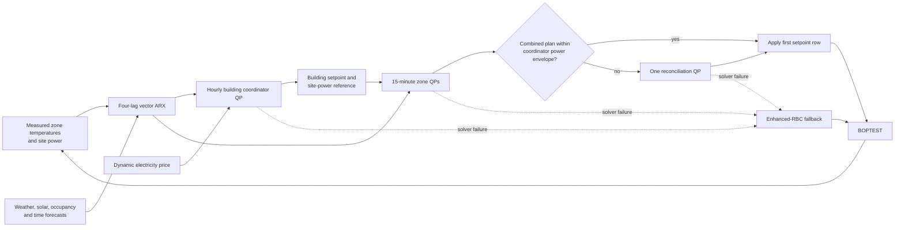

# Hierarchical MPC baseline

This document is the method and implementation owner for the hierarchical model predictive
control (MPC) baseline shipped with H3C. It explains the model, identification data, two-level
optimizer, runtime contract, frozen assets, and formal evaluation evidence needed to reproduce
and describe the baseline accurately.

## Summary

The baseline is a data-driven, two-level receding-horizon controller. Every case uses the same
four-lag vector autoregressive model with exogenous inputs (vector ARX), a four-step (one-hour)
prediction horizon, an hourly building coordinator, and 15-minute zone optimizers. The
structural equations and shared objective weights are fixed across cases; the zone dimension,
fitted coefficients, model-selected ridge coefficient, residual-calibrated PMV margin, and
pre-existing case-profile objective scales remain case specific.

The three frozen models were identified entirely from repeated simulations of the seven calendar
days immediately before each case's evaluation window. No evaluation-window sample was used for
identification, model selection, residual calibration, or tuning. The formal evaluation then ran
one fresh arm per case under the same initialization and the same public reward, comfort,
effective-occupancy, and KPI owners used to score the other baselines. Controller-internal inputs
remain method specific: in particular, the frozen DRL policies retain their original policy-side
occupancy and comfort-input contracts.

All three MPC arms improved reward relative to Basic RBC. MZ Hydro and MZ Air completed without a
controller fallback; SZ Air used the registered enhanced-RBC fallback once after OSQP reached its
iteration limit. The baseline is therefore suitable as a real, reproducible comparison method,
but it did not dominate P0/eRBC or every DRL policy and should not be described as universally
superior.

## Control architecture



The hierarchy is genuine even for the single-zone case: the same coordinator/zone interface and
timing are retained, while the lower layer contains one zone optimizer.

At control step \(k\):

1. the building coordinator solves a full-building QP at the start of each hour;
2. between hourly updates, its four-step reference is shifted and its final cached row is filled
   by Basic RBC using occupancy at \(k+3\);
3. every zone solves a local QP against its contribution to the coordinator's predicted power
   envelope;
4. if the combined local plan exceeds that envelope, exactly one reconciliation QP projects it
   back into the admissible region;
5. only the first 15-minute setpoint row is applied, and the process repeats at \(k+1\).

## Predictive model

### Shared vector-ARX structure

For all cases, the one-step model is

\[
\mathbf y_{k+1}=\mathbf c
+\sum_{j=0}^{3}\mathbf A_j\mathbf y_{k-j}
+\sum_{j=0}^{3}\mathbf B_j\mathbf u_{k-j}
+\mathbf E\mathbf d_k .
\]

The variables are:

- \(\mathbf y\): all zone air temperatures followed by total site electrical power;
- \(\mathbf u\): the cooling setpoint of every zone;
- \(\mathbf d\): outdoor temperature, solar irradiance, effective occupancy for every zone, and
  sine/cosine time-of-day encoding.

Electricity price is deliberately excluded from the physical model and enters only the control
objective. The model uses four 15-minute lags and is recursively rolled out for four steps. Thus,
the prediction and control horizons are both one hour. Inputs and outputs are standardized using
fit-set statistics; constant columns use unit scale.

The ordinary recursive predictor clips a negative site-power prediction to zero before feeding it
into the next rollout step. The QP's affine rollout instead retains the unclipped affine power and
uses a nonnegative epigraph, preventing a negative prediction from creating artificial energy
credit while preserving convexity.

For \(N_z\) zones, the standardized regression has \(9N_z+8\) input features and \(N_z+1\)
outputs: 17-by-2 for SZ Air, 26-by-3 for MZ Hydro, and 53-by-6 for MZ Air. “Four lags” means the
current sample and the three preceding samples. The intercept is not ridge-penalized.

The feature order, scaling arrays, intercept, coefficient matrix, ridge coefficient, robust PMV
margin, and model identity are stored in each case's `model_coefficients.npz`. Loading uses
`allow_pickle=False`, and the registry recomputes both the coefficient SHA-256 and semantic model
identity before use.

### Ridge selection and holdout isolation

The registered ridge grid is

\[
\alpha\in\{10^{-6},10^{-4},10^{-2},1,100\}.
\]

Each candidate is fitted on standardized data. Alpha is selected using mean standardized RMSE on
four complete holdout episodes, with the larger alpha selected when scores are equal within an
absolute tolerance of \(10^{-12}\). Holdout episodes are used only for alpha selection and the
persistence-model gate; they are never included in the final coefficient fit or PMV-residual
calibration.

The selected alphas are 1.0 for SZ Air and MZ Hydro, and \(10^{-4}\) for MZ Air.

## Identification data and fairness

### Time boundary

Only samples from the week immediately before formal evaluation enter MPC identification,
ridge selection, and residual calibration:

| Case | Identification week | Formal evaluation |
|---|---|---|
| SZ Air | days 196–202 | day 203, 7 days |
| MZ Hydro | days 213–219 | day 220, 5 days |
| MZ Air | days 192–198 | day 199, 7 days |

The same calendar week is simulated repeatedly with different deterministic excitation sequences.
Each episode is a fresh BOPTEST initialization with the complete seven-day internal warm-up; no
physical state is carried between episodes. A lane selects one test identity, repeatedly
initializes it for its assigned episodes, and stops it once when the lane is complete.

During formal online control, MPC still observes the current evaluation-window state and the
registered four-step weather, occupancy, and price forecasts. The table constrains offline model
development data; it does not hide contemporaneous online measurements or forecasts.

### Excitation and data roles

Identification uses bounded deterministic PRBS/GBN setpoint excitation with 30-, 60-, and
120-minute dwell times. Occupied setpoints are restricted to 23.5–26.5 °C and unoccupied
setpoints to 20–30 °C. If occupied absolute PMV exceeds 0.70, the episode temporarily applies the
canonical P0/eRBC recovery action until PMV returns to at most 0.50.

The final offline refit reused the preserved real episode bank; it made no BOPTEST call and
generated no synthetic training label. Episode roles were fixed as follows:

| Case | Excitation episodes in fit | Basic RBC reference | Adaptive validation in fit | Complete holdouts | Residual-calibration episode | Fit rows |
|---|---:|---:|---:|---:|---:|---:|
| SZ Air | 64 | 1 | 2 | 4 | validation-064 | 44,815 |
| MZ Hydro | 32 | 1 | 2 | 4 | validation-032 | 23,407 |
| MZ Air | 64 | 1 | 2 | 4 | validation-032 | 44,815 |

The first two zero-fallback validation episodes were admitted to the fit set. The final
zero-fallback validation episode was reserved for PMV residual calibration. Validation episodes
containing fallback were excluded. Four whole-episode holdouts remained isolated throughout.

This final refit was a separately preregistered post-result recovery after the original training
suite failed its MZ Air closed-loop comfort gate. It reused only preserved trajectories, added no
physical or model call, and was followed by fresh validation. That validation was later frozen
through an explicit post-result degraded-admission path after one SZ Air fallback. Formal results
were never used for fitting, calibration, model selection, or controller tuning.

This design gives MPC repeated interactions with only the registered training week while
preventing access to earlier weather weeks or the formal evaluation window. It is a temporal
fairness boundary, not a claim that MPC and the frozen DRL policies received identical training
samples, weather exposure, or interaction counts.

## Optimization problem

### Shared objective

The coordinator uses the same three objective components and case-specific scale factors as the
public H3C reward owner. With \(N_z\) zones and four horizon steps, its QP has the form

\[
\min_{\mathbf u,\mathbf p^+,\boldsymbol\xi,\mathbf s}
\sum_{t=0}^{3}\left[
\frac{w_E s_E}{N_z}\,\pi_{k+t}p^+_{k+t}\Delta t
+\frac{w_C s_C}{N_z}\sum_z \xi_{t,z}^{2}
+\frac{w_S s_S}{N_z}\sum_z s_{t,z}
\right],
\]

where \(\pi\) is dynamic electricity price, \(p^+\) is a nonnegative epigraph of predicted site
power, \(\xi\) is occupied PMV-band excess, and \(s\) is absolute setpoint movement. The weights
are \(w_E=1\), \(w_C=20\), and \(w_S=0.1\); the corresponding scale factors are read unchanged
from each case profile. The 15-minute energy conversion is included in the cost term.

PMV is deterministically linearized around the warm trajectory using the shared comfort owner:

\[
\widehat{\mathrm{PMV}}_{t,z}\approx a_{t,z}\widehat T_{t,z}+b_{t,z}.
\]

The slope uses a centered finite difference with a \(0.05\,^{\circ}\mathrm C\) temperature step.

Only occupied steps incur comfort excess. A case-specific robust margin, estimated as the 95th
percentile (`higher` order statistic) of absolute occupied PMV prediction residuals, contracts the
internal soft band from 0.50 to:

| Case | PMV margin | Internal soft band |
|---|---:|---:|
| SZ Air | 0.30 | 0.20 |
| MZ Hydro | 0.14 | 0.36 |
| MZ Air | 0.18 | 0.32 |

This margin changes only the MPC soft comfort target. It does not modify the public PMV metric,
comfort model, reward owner, or the reported \(|\mathrm{PMV}|\le0.70\) comfort target. That target
is performance evidence, not a solver constraint or execution-validity gate.

### Coordinator, zone, and reconciliation constraints

The coordinator enforces:

- registered occupied/unoccupied setpoint support bounds used by both identification and online
  optimization;
- a nonnegative epigraph for predicted site power, so negative affine power predictions do not
  create artificial energy credit;
- absolute setpoint-movement epigraphs;
- occupied PMV-excess epigraphs around the calibrated internal band.

Each local zone QP minimizes its own comfort excess and setpoint movement while holding the other
zones at the coordinator reference. Its predicted contribution to site power may not exceed the
corresponding coordinator contribution. If independently optimized zone plans jointly violate the
building envelope, one reconciliation QP minimizes squared distance to the local plans subject to
the full-building power envelope and setpoint bounds. The production implementation solves zone
QPs sequentially in deterministic zone order; it does not perform a zone-to-coordinator comfort
or infeasibility feedback re-solve.

OSQP solves every QP with absolute and relative tolerances of \(10^{-5}\), polishing enabled,
adaptive rho, and a 50,000-iteration limit. Only exact `solved` status is accepted. Any exception,
non-finite solution, infeasibility, or iteration-limit result applies the current enhanced-RBC
warm-start action for that step and records `method_degraded=true`; fallback is never silent.

### Horizon indexing

Actions, disturbances, constraints, and prices cover \(k,\ldots,k+3\). When the hourly reference
is shifted, its final cached action uses occupancy at \(k+3\). The runtime also requires a finite
occupancy forecast at \(k+4\) as a terminal-data integrity check, but the frozen implementation
does not use that value in the online QP or cached action. This boundary is covered by the horizon
fixtures and should not be described as a terminal comfort constraint.

## Frozen model identities

| Case | Zones | Ridge alpha | Model identity |
|---|---:|---:|---|
| SZ Air | 1 | 1.0 | `f2af2932cae8fb4b8846fc921fbdfcfeec359530bd513b3f4a9cee556e39d231` |
| MZ Hydro | 2 | 1.0 | `04c02b14a69a23f0e698371aee16c8c9093dd3baee2373984692e617ce4aecb1` |
| MZ Air | 5 | 0.0001 | `b5ee83dfa2670472c8f1db413b90ab582508f5a660d9d3a641dd65c296f4a17e` |

The common freeze identity is
`f5cf1873428d81ad0ab9f5d60abbb564788a202683aa047865175f04cc78a467`.
The cards intentionally record `admission_mode=post_result_method_degraded`: the preserved
validation evidence included one fallback for SZ Air and a comfort-target miss for MZ Air. The
user subsequently accepted the operationally complete models as the transparent baseline. This
provenance must not be rewritten as a preregistered strict-pass claim. Under the frozen baseline
admission rule, SZ Air is `METHOD-DEGRADED-VALIDATION`; MZ Hydro and MZ Air are
`BASELINE-READY`.

## Formal evaluation

Each frozen controller was evaluated exactly once on a fresh test identity. Evaluation used a
900-second step, dynamic electricity price, one seven-day internal warm-up, no explicit control
prefix, and the registered case window. At the formal boundary, the measured output and a 25 °C
setpoint are repeated to initialize the four-row ARX history; warm-up history is not imported into
the controller state.

The formal source commit is `53983f2411fe536435c708c88f3adada3080d393`; the concurrent suite
evidence identity is
`01110593a406bec25858b71a91b231e0f004128c08078cd8bee414af3770d51c`. The run identities are
`07105570839a...` (SZ Air), `9954bed3f594...` (MZ Hydro), and `f028b98b764b...` (MZ Air); their
complete identities and fresh test IDs are retained in the linked formal-result document.

| Case | Cost | Energy (kWh) | Reward | Discomfort zone-h | PMV-exceedance h | Peak occupied \|PMV\| | Setpoint TV (°C) | Reversals | Fallbacks | Classification |
|---|---:|---:|---:|---:|---:|---:|---:|---:|---:|---|
| SZ Air | 5.510229 | 55.963611 | -670.610306 | 1.750 | 0.090000 | 0.570 | 185.952 | 264 | 1 | `METHOD-DEGRADED` |
| MZ Hydro | 119.634309 | 777.274964 | -180.148199 | 0.000 | 0.000000 | 0.480 | 79.355 | 271 | 0 | `BASELINE-PASS` |
| MZ Air | 155.401137 | 1385.508414 | -591.127379 | 5.500 | 0.427500 | 0.780 | 718.531 | 1124 | 0 | `BASELINE-PASS` |

Positive reward deltas below mean MPC achieved the better objective value.

Here, discomfort zone-hours count occupied zone-hours with \(|\mathrm{PMV}|>0.5\), and
PMV-exceedance hours integrate the occupied excess above that threshold. Peak values are also
restricted to occupied samples.

| Case | Comparator | Reward delta | Cost delta | Energy delta |
|---|---|---:|---:|---:|
| SZ Air | Basic RBC | +45.971 (+6.42%) | -7.28% | -7.97% |
| SZ Air | P0/eRBC | -30.106 (-4.70%) | +3.76% | +1.28% |
| SZ Air | C-DRL | -34.129 (-5.36%) | +4.46% | -2.92% |
| MZ Hydro | Basic RBC | +86.891 (+32.54%) | -32.56% | -32.51% |
| MZ Hydro | P0/eRBC | -0.794 (-0.44%) | +0.60% | -0.14% |
| MZ Hydro | C-DRL | +26.711 (+12.91%) | -10.71% | -10.80% |
| MZ Hydro | H-DRL | +29.278 (+13.98%) | -8.92% | -8.94% |
| MZ Air | Basic RBC | +136.057 (+18.71%) | -20.47% | -19.08% |
| MZ Air | P0/eRBC | -31.997 (-5.72%) | +3.57% | +2.09% |
| MZ Air | C-DRL | +27.851 (+4.50%) | -5.42% | -9.48% |
| MZ Air | H-DRL | -45.341 (-8.31%) | +9.91% | +1.26% |

The one-step formal-trajectory diagnostics were:

| Case | Zone-temperature RMSE (°C) | Site-power RMSE (W) | Mean wall-clock elapsed per evaluation step (s) |
|---|---|---:|---:|
| SZ Air | zone1: 0.480 | 62.4 | 0.070 |
| MZ Hydro | NZ: 0.066; SZ: 0.071 | 2,443.5 | 0.228 |
| MZ Air | zones: 0.239–0.319 | 2,915.6 | 0.623 |

The sole formal fallback occurred at SZ Air step 4 when the building coordinator reached the
50,000-iteration OSQP limit; enhanced RBC supplied that step's action. MZ Air's peak occupied
absolute PMV of 0.78 is an adverse comfort result even though the run was execution-valid. Both
facts remain visible in the evidence and should accompany any performance claim.

The elapsed values include physical-client time and evidence I/O; they are not pure QP solver
benchmarks. The one-step RMSE values are post-hoc explanatory diagnostics and were not used for
model selection or tuning.

## What the evidence supports

The evidence supports the following claims:

- a common, interpretable vector-ARX/QP structure can operate across one-, two-, and five-zone
  cases without case-specific algorithm changes;
- each of the three registered single formal runs achieved a higher common reward than Basic RBC;
- on MZ Hydro, it nearly matches P0/eRBC reward and numerically exceeds C-DRL and H-DRL reward by
  12.91% and 13.98%, respectively;
- the method is computationally feasible at a 15-minute control interval;
- model, optimizer, fallback, and physical trajectories are independently auditable.

The evidence does not support claims that MPC is always better than P0/eRBC or DRL, that the
short identification week captures all building dynamics, or that no solver degradation can
occur. PMV is a soft local linearization rather than a hard guarantee or a causal model. The
formal results are a single registered arm per case and should be reported as such; they do not
estimate run-to-run variance or cross-season generalization.

## Reproduction and evidence

Install the independent baseline dependencies:

```console
uv sync --extra baselines
```

Verify the frozen bundle without contacting BOPTEST:

```console
h3c-baseline mpc verify-model --case SZ_Air
h3c-baseline mpc verify-model --case MZ_Hydro
h3c-baseline mpc verify-model --case MZ_Air
```

Review a dry plan, then explicitly execute one arm or the three-case suite:

```console
h3c-baseline run --case MZ_Hydro --controller hierarchical-mpc
h3c-baseline run --case MZ_Hydro --controller hierarchical-mpc --execute
h3c-baseline suite mpc-formal
h3c-baseline suite mpc-formal --execute
```

Generated trajectories remain ignored under `outputs/baselines/`. Each formal run contains the
resolved configuration, physical conditioning, 15-minute performance and action traces,
controller diagnostics, model identity, native BOPTEST KPIs, common metrics, verification, and an
atomic completion record. The tracked method owners are:

| Concern | Owner |
|---|---|
| ARX layout, fitting, scaling, identity | `src/h3c_baselines/mpc/vector_arx.py` |
| Identification and episode acquisition | `src/h3c_baselines/mpc/training.py` |
| Offline refit and residual calibration | `src/h3c_baselines/mpc/refit.py` |
| Building/zone QPs and fallback | `src/h3c_baselines/mpc/optimizer.py` |
| Frozen model verification | `src/h3c_baselines/mpc/registry.py` |
| Physical validation | `src/h3c_baselines/mpc/validation.py` |
| Formal runtime | `src/h3c_baselines/runtime/runner.py` |
| Model assets and provenance | `models/mpc/` |

The exact formal numbers and run identities are preserved in
[`hierarchical_mpc_formal_evaluation_result_20260831.md`](hierarchical_mpc_formal_evaluation_result_20260831.md).

## Paper-ready method description

For concise reuse in a methods section:

> We implemented a two-level data-driven MPC baseline with a common vector-ARX structure across
> all cases. The model predicts all zone temperatures and total site power from four 15-minute
> lags of outputs and cooling setpoints, together with outdoor temperature, solar irradiance,
> zone occupancy, and time-of-day inputs. Ridge coefficients were identified from repeated,
> fully warmed simulations of the seven days immediately preceding evaluation. Whole holdout
> episodes were excluded from coefficient fitting and residual calibration but used for ridge
> selection and persistence gating. This final refit was a separately preregistered post-result
> recovery using only preserved trajectories; fresh validation was subsequently frozen through an
> explicit degraded-admission path, and formal results were not used for tuning. Every hour, a
> building-level convex QP used the public reward weights to optimize dynamic electricity cost,
> occupied PMV-band excess, and setpoint variation over a one-hour horizon.
> Zone-level QPs then refined 15-minute setpoints subject to their coordinator-assigned power
> contributions; one deterministic reconciliation was permitted if the combined local plan
> exceeded the building power envelope. Only the first control move was applied. The optimizer
> used the public comfort model for its PMV approximation, while formal scoring used the shared
> public reward, comfort, effective-occupancy, and KPI owners. Any solver failure invoked and
> explicitly recorded the canonical enhanced-RBC fallback.
