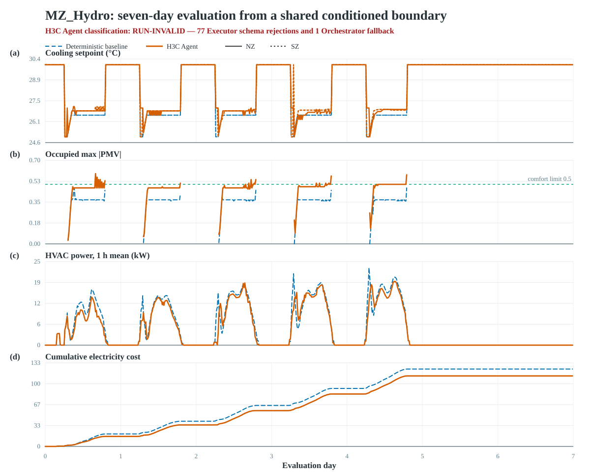

# Rationale contract repair and MZ_Hydro seven-day result

Status: final comparison result for implementation source
`8cbf352f48536969f401d8f76cf394fcd580dc5f`. The focused smoke and both
formal arms were run once, in the preregistered order. No formal arm was rerun.

## Result in one paragraph

The rationale correction itself worked: otherwise-valid Orchestrator and
Executor rationales were accepted without a character threshold and preserved
in full, including real accepted text as long as 720 and 632 characters. The
focused smoke was a clean `RELEASE-PASS`, and the zero-API deterministic
baseline was also a `RELEASE-PASS`. The seven-day H3C Agent completed its full
physical trajectory and reduced cost by 8.8906% and energy by 9.1922% relative
to the baseline, but it increased discomfort from zero to 4.75 zone-hours and
0.165 PMV-hours, increased peak occupied absolute PMV from 0.47 to 0.59, and
was classified `RUN-INVALID`. The invalid classification came from one strict
Orchestrator root-schema failure and 77 strict Executor schema failures, not
from rationale length. Therefore the physical savings are descriptive only:
this run does not establish the project G1 claim or a releasable H3C result.

## Contract change and frozen replay

| Surface | Historical `8a58a84` contract | New `8cbf352f` contract |
|---|---|---|
| Orchestrator/Executor rationale | A 240-character limit could degrade the model contract, trigger allocation fallback, reject a patch, or produce deterministic `no_change` | Any nonempty string is accepted regardless of length and preserved exactly; length is telemetry with `decision_use=none` |
| Executable validation | Strict JSON/schema/type/zone/program/causal/direction/budget/settlement/identity/secret gates | Unchanged and fail closed |
| Provider I/O boundary | Existing output-token limit | Unchanged; no new method-level character limit |
| Reflector | One-sentence `insight_text` contract | Unchanged |
| Historical evidence | Interpreted by its original source | Not rewritten or reverified under the new contract |

The fixed production replay contains all 11 over-240 outputs from final source
`8a58a84`: six SZ_Air Orchestrator allocations and five MZ_Air Executor
patches. Fixture SHA-256:
`fdd1514ee566ad696025571fc4cc7a2ca0eb2fc0b85d33c472e41ec19af04dce`.
All 11 kept identical raw and parsed rationale text and retained their original
allocation or patch. Negative replay still rejected invalid bare JSON, unknown
`id`, blank/non-string rationale, tampering, and genuinely invalid control
content. The complete offline gate was 217 pytest tests, 20 fake-physical
integration tests, Ruff check/format, strict mypy, lock verification, Prompt
oracle, CLI/profile/config/secret/scope gates, and standalone-root replay; all
passed before any real call.

## Focused six-hour release smoke

The unique smoke was run at
`outputs/runs/release-6h/MZ_Hydro/20260827T231121516097Z-d34ff11f3aca`.
It used the seven-day server warm-up, the same-test-id seven-day vanilla RBC
prefix (25 degC occupied, 30 degC unoccupied), and a six-hour Agent evaluation.
Production verification returned `RELEASE-PASS`: all execution-integrity and
model-contract checks were true, with zero fallback, retry, terminal transport,
secret, evidence, or stderr errors.

| Smoke quantity | Result |
|---|---:|
| Logical calls / wire attempts | 24 / 24 |
| Orchestrator / Executor / Reflector | 6 / 12 / 6 |
| Thinking route | 24 disabled, 0 low |
| Prompt / completion / total tokens | 53,519 / 2,282 / 55,801 |
| Model latency total / mean / maximum | 28.745962 / 1.197748 / 1.835673 s |
| Estimated model cost | USD 0.0044788072 / CNY 0.03199148 |
| Physical cost / energy | 0.4753329863 / 3.4494411200 kWh |
| Zone-hours / PMV-hours / occupied peak absolute PMV | 0 / 0 / 0 |

The smoke's longest Executor rationale was 287 characters and was preserved
raw and parsed without truncation or control degradation. The 12 Executor
rationales contained 3,135 characters in total; the 12 Orchestrator zone
rationales contained 2,010 characters. This released the formal pair without
an additional approval stop.

## Common formal protocol and identity

Both arms used source `8cbf352f`, profile `MZ_Hydro`, day 220, a 900-second
control step, seven requested warm-up days, seven same-test-id vanilla RBC days,
and 168 evaluation hours (672 steps). They shared physical endpoint identity
`e79d0b65276c07c71c85449933f964fb160753a704d54eada6f7bd682b7b27da`,
conditioning-prefix identity
`b834786a4e5cf680e28899ee830ea2dab720b3877963a4695e566759c843101c`,
and evaluation-boundary identity
`6880d6479e603e5c203a0b5e82dedaa30fe158c57d7404917a599493c43ec3df`.
The conditioning streams matched at all 672 records apart from fresh test id;
the first evaluation physical record was identical, including temperatures,
setpoints, PMV, occupancy, power, and physical time.

The baseline used fresh test id `3fc0dea1-05a7-4d85-874b-95ade02b2386`, run
`20260827T231553926586Z-ebaf1f6d2f43`, launcher/supervisor PID 6132, and
execution worker PID 14396. It completed in 145.054716 seconds with zero model
calls. The Agent used fresh test id `8af8b5d7-7c4e-485b-8e8c-fad82faf6407`,
run `20260827T232744965507Z-2b5dd8e99955`, and process chain supervisor PID
15756 -> CLI/interpreter PID 25328 -> `.execution.lock` holder PID 8472. It
completed the full run in approximately 3 h 6 min 32 s. Its model endpoint
identity was
`a34e2a4708ed1c61008a151688838dcf1c44d4e7f08054633e72ba7c0b16cfc1`.

## Seven-day physical comparison

| Metric | Zero-API deterministic baseline | H3C Agent | Agent - baseline |
|---|---:|---:|---:|
| Production classification | `RELEASE-PASS` | `RUN-INVALID` | -- |
| Cost | 123.530880 | 112.548217 | -10.982663 (-8.8906%) |
| Energy (kWh) | 808.699085 | 734.362240 | -74.336845 (-9.1922%) |
| Discomfort (zone-h) | 0 | 4.75 | +4.75 |
| Discomfort (PMV-h) | 0 | 0.165 | +0.165 |
| Occupied peak absolute PMV | 0.47 | 0.59 | +0.12 (+25.5319%) |
| Setpoint total variation (degC) | 100.6 | 131.9 | +31.3 (+31.1133%) |
| Direction reversals | 20 | 80 | +60 (+300%) |
| Occupied comfort-band crossings | 0 | 36 | +36 |
| Reward | -186.179586 | -173.620404 | +12.559182 |

Both controllers had zero actuator-bound, setpoint-rate-limit, and
comfort-recovery assurance triggers and zero assurance adjustment magnitude.
The Agent's energy/cost savings therefore coincided with worse comfort and much
more setpoint activity; they cannot be presented as simultaneous non-inferiority.

## Program and model behavior

The Agent produced 195 valid `no_change` decisions, 32 accepted executable
updates, 32 genuine deterministic control rejections, and 77 model-output
schema rejections. Accepted operations were six `add_rule`, two `remove_rule`,
eight `replace_rule`, and 16 `set_param`, split evenly between NZ and SZ.

The genuine rejection codes were 10 `missing_weather_driver_edge`, one
`irrelevant_edge`, 16 `program_direction_undetermined`, three `out_of_box`, and
two `semantic_noop`; there were no energy-budget-exhausted rejections.
Deterministic settlement replay passed. Validation reached program, causal,
direction, and energy-budget stages 254, 227, 227, and 227 times respectively.
Coordination granted 333.75 degC and used 3.95 degC; one hour used the existing
deterministic allocation fallback.

The fail-closed model-contract events were:

- one Orchestrator response at hour 41 wrapped an otherwise parseable
  allocation in an extra root key `allocation_contract`; exact schema rejected
  it and used the previous valid allocation;
- 71 Executor responses had more than the single allowed patch operation
  (69 roots contained `patch` plus `rationale`, two contained `patch` plus
  `root`);
- six Executor responses added unknown patch field `id`.

These failures were not caused by rationale length and were not retried. They
explain the false `fallback_count_zero`, `json_schema`, and
`role_contract_audit` checks. The aggregate verifier also reports
`rationale_persistence=false` because rejected model-contract rows cannot
satisfy accepted-output persistence; direct accepted-output replay nevertheless
proved zero raw/parsed mismatches and zero truncation for every valid rationale.

## Calls, routes, tokens, latency, and price estimate

The Agent made exactly 672 logical calls: Orchestrator/Executor/Reflector
168/336/168. Occupancy routing assigned 412 calls to thinking disabled and 260
to low-effort thinking. The actual wire count was 674 because two first attempts
ended in `ConnectionResetError`; both were the preregistered identical-wire
transport recovery, did not advance the physical service, and succeeded on the
next attempt. Terminal transport failures were zero. The two failed attempts
have unknown provider charge and are counted separately from the fixed-price
estimate.

| Group | Calls | Prompt | Completion | Reasoning | Total tokens | Latency total / mean / max (s) |
|---|---:|---:|---:|---:|---:|---:|
| Thinking disabled | 412 | 1,012,883 | 56,042 | 0 | 1,068,925 | 626.967692 / 1.521766 / 3.418643 |
| Thinking low | 260 | 652,350 | 1,060,333 | 1,011,606 | 1,712,683 | 9,443.620887 / 36.321619 / 121.949667 |
| Orchestrator | 168 | 313,650 | 303,558 | 259,519 | 617,208 | 2,755.779805 / 16.403451 / 79.695081 |
| Executor | 336 | 1,242,435 | 713,048 | 664,662 | 1,955,483 | 6,392.104755 / 19.024121 / 121.949667 |
| Reflector | 168 | 109,148 | 99,769 | 87,425 | 208,917 | 922.704019 / 5.492286 / 35.027313 |
| **All logical calls** | **672** | **1,665,233** | **1,116,375** | **1,011,606** | **2,781,608** | **10,070.588579 / 14.985995 / 121.949667** |

Prompt cache accounting was 849,792 hit and 815,441 miss tokens. The
`project-fixed-v1` estimate was USD 0.4291261576 / CNY 3.06518684, excluding
unknown provider charge for the two failed wire attempts. This run demonstrates
why it felt slow: the 260 low-thinking calls accounted for 93.77% of aggregate
model latency, with mean latency 36.32 seconds, while disabled calls averaged
1.52 seconds.

## Rationale persistence proof

Among schema-valid outputs, the Agent recorded 259 Executor rationales
(91,944 characters, maximum 632, 232 over 240) and 334 Orchestrator zone
rationales from 167 calls (122,909 characters, maximum 720, 332 over 240).
An independent three-stream join of `raw_model_io.jsonl`, `agent_calls.jsonl`,
and program/hourly artifacts found 672/672 matching call identities, zero raw
versus parsed mismatches for all 259 valid Executor rationales, and zero
mismatches for all 334 valid Orchestrator zone rationales. Length remained
`decision_use=none`; no accepted text was clipped or replaced because it was
long.

## Time series

The source data are the two immutable `performance.csv` streams. The tracked
generator is `figures/gen_fig_mz_hydro_7day_timeseries.js`; vector PDF and
300-dpi PNG variants accompany the SVG. The figure deliberately labels the
Agent `RUN-INVALID` so the energy/cost curves cannot be detached from the
contract and comfort result.

## Classification, limitations, and next boundary

The rationale contract correction is verified and release-suitable as a
non-execution text fix. The formal baseline is valid. The formal H3C Agent is
not release-suitable because its completed evidence contains strict model
schema violations and fallback, and its comfort is worse than the zero-loss
baseline. This is one fresh trajectory per arm (`n=1`), so it is not a variance
estimate. Fixed-price cost omits uncertain billing for two failed wire attempts.
Natural-language rationale supports auditability but does not itself prove that
a patch was caused by a particular input; mechanism claims remain tied to the
structured admission/program/action/physical chain.

The Agent's inline production verifier completed with the run and atomically
wrote the `RUN-INVALID` `verification.json` at 10:34:13 local time. A later
redundant explicit invocation began recomputing the complete seven-day evidence;
one accidentally duplicated invocation was interrupted immediately, and the
original remained CPU-active without changing the run evidence. At 12:02 the
user ruled that this second full replay was unnecessary, so that post-run
verifier process chain was stopped before writeback. The classification in this
report is the completed inline production result, not an invented or partially
replayed replacement; raw experiment artifacts were not changed.

No rerun, extra smoke, three-case formal suite, ablation, method repair, paper
edit, or push follows from this result. Any attempt to reduce strict-schema
failures or improve the comfort/energy trade-off is a new method task requiring
a new preregistration and source identity; this evidence must remain unchanged.
